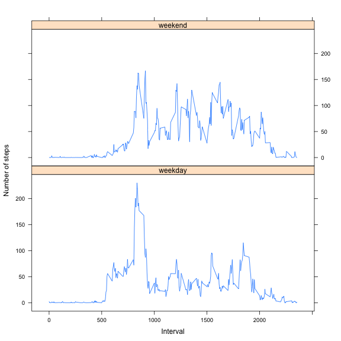

Loading my libraries

```r
library(lubridate)
library(dplyr)
library(lattice)
```

Set some options

```r
options(scipen=1,digits=3)
```


## Loading and preprocessing the data

```r
d <- read.csv("activity.csv",stringsAsFactors=FALSE)
d$date <- ymd(d$date)
```


## What is mean total number of steps taken per day?


```r
dailyActivity<-group_by(d,date)
dailyActivity<-filter(dailyActivity,!is.na(steps))
dailyActivity <- summarise(dailyActivity,steps=sum(steps))
hist(dailyActivity$steps,main = "Histogram of the Total Number of Steps Taken Each Day",xlab = "steps")
```

 

```r
myMean <- mean(dailyActivity$steps)
myMedian <- median(dailyActivity$steps)
```

The mean number of steps per day is 10766.189 and the median number of steps per day is 10765.

## What is the average daily activity pattern?


```r
dailyActivity<-filter(d,!is.na(steps))
dailyActivity<-arrange(dailyActivity,interval)
dailyActivity<-group_by(dailyActivity,interval)
dailyActivity<-summarise(dailyActivity,avg = mean(steps))
with(dailyActivity, plot(interval,avg,type="l",main="Average Steps Taken",ylab="Average Steps"))
```

 

```r
myMaxInterval<- dailyActivity$interval[which.max(dailyActivity$avg)]
```

The interval 835 contains the maximum average steps of 206.17.

## Imputing missing values

So what I decided to do for this was to replace NA's with the average number of steps for that interval across all days.


First create a function which either leaves it alone if it is valid or replaces it if it is NA.

```r
meanIfNA <- function(interval,value,means){
  if(is.na(value)){
    value<-means$avg[[match(interval,means$interval)]]
    #value<-0
  }
  as.numeric(value)
}
```

Now we create a new column where the missing values are replaced.

```r
d <- d %>% rowwise() %>% mutate(newSteps=meanIfNA(interval,steps,dailyActivity))
```

Create the histogram on this new steps field.

```r
dailyActivity<-group_by(d,date)
```

```
## Warning: Grouping rowwise data frame strips rowwise nature
```

```r
dailyActivity <- summarise(dailyActivity,steps=sum(newSteps))
hist(dailyActivity$steps,main = "Histogram of the Total Number of Steps Taken Each Day (replacing NA's with average)",xlab = "steps")
```

 

```r
myMean2 <- mean(dailyActivity$steps)
myMedian2 <- median(dailyActivity$steps)
```

The new mean is 10766.189 which is the same as the old mean but the new median is 10766.189 as opposed to 10765.  The mean didn't change because I was replacing the values with the means.  

## Are there differences in activity patterns between weekdays and weekends?

So first we have to add in a factor variable for weekday vs weekend


```r
d$isWeekend <- wday(d$date) %in% c(1,7)
d$isWeekend <- as.factor(d$isWeekend)
levels(d$isWeekend) <- c("weekday","weekend")
```

Now we need to do some grouping to get the average steps per interval split out by weekday/weekend

```r
d <- as.data.frame(d)
activity <- group_by(d,isWeekend,interval)
activity <- summarise(activity,newSteps=mean(newSteps))
```

Now simply make the plot

```r
xyplot(newSteps ~ interval | isWeekend, data=activity, type='l',layout=c(1,2),xlab="Interval",ylab="Number of steps")
```

 

